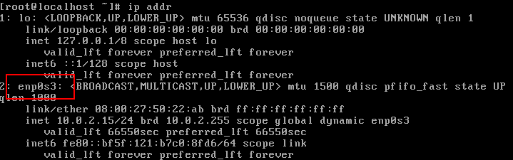

# CentOS VirtualBox 无法访问网络

使用的镜像是CentOS 7 minimal版本，使用桥接模式后，无法访问网络

步骤如下：

 * 使用`ip addr`查看已有网络设备

 

 * 使用`vi`或其他编辑器打开`/etc/sysconfig/network-scripts/ifcfg-enp0s3`

 * 修改`ONBOOT`配置修改为`yes`，最终`ONBOOT=yes`，保存退出

 * 重新启用网络服务，执行`service network restart`

 * `ping`一下是否正常