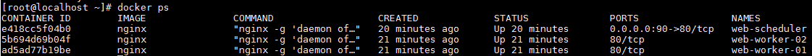

# 使用 Docker 测试 Ngnix 负载均衡

```bash
docker run --name web-worker-01 -d nginx
docker run --name web-worker-02 -d nginx
docker run --name web-scheduler \
--link web-worker-01:web-worker-01 \
--link web-worker-02:web-worker-02 -p 90:80 -d nginx
```

<!-- more -->

使用`docker run`启动三个容器服务，两台`worker`，对外提供服务的命名为`web-scheduler`，并使用`--link`选项，使用在`scheduler`中可以访问到两台`worker`。如下图所示：



使用`docker exec`进行`scheduler`容器

```bash
docker exec -it web-scheduler /bin/bash
```

编辑`/etc/nginx/nginx.conf`和`/etc/nginx/conf.d/default.conf`这两个文件，默认的`nginx`镜像中没集成`vim`工具，可自行使用`apt-get install`安装。

在`http`块中加入`upstream`块，修改`location`块进行转发

修改如下:

```nginx
# /etc/nginx/nginx.conf

http {
    upstream backend {
        server web-worker-01;
        server web-worker-02;
    }
}

######################################

# /etc/nginx/conf.d/default.conf

server {
    location / {
        proxy_pass http://backend;
    }
}
```

作为测试，直接修改两台`worker`中的主页的内容，实际情况中，`worker`的代码应保持一致。

## upstream 配置

> round-robin

也就是轮询。如果不指定特定配置，`轮询`则为默认配置。所有请求依次有序地、逐个请求各台`worker`

> least_conn

请求分配置更为公平，适用于个别请求需要执行较长时间

```nginx
upstream backend {
    least_conn;
    server web-worker-01;
    server web-worker-02;
}
```

> ip_hash

使用该配置，可保证`session`信息持久化，可避免单个认证会话在不同`worker`间信息不统一。若考虑将`session`信息持久化到数据库，或许可以考虑不使用该配置。

```nginx
upstream backend {
    ip_hash;
    server web-worker-01;
    server web-worker-02;
}
```

> 使用权重 weight

使用`weight`可以用于标识各个`worker`的应处理多大的请求，可适用于由不同配置的`worker`组成的集群，避免让性能较差的`worker`执行较多的请求。


## 参考

* [Ngnix offical load balance tutorial](http://nginx.org/en/docs/http/load_balancing.html)
* [Nginx http upstream module](http://nginx.org/en/docs/http/ngx_http_upstream_module.html)