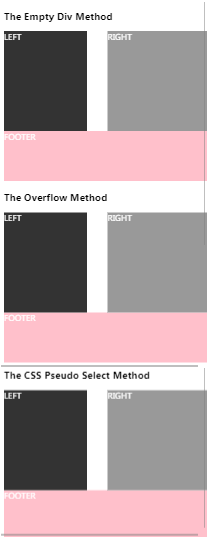

# problems caused by CSS float

```css
body {
    color: #ffffff;
}

h3 {
    color: #000000;
}

.container {
    width: 100%;
}

.leftside {
    width: 40%;
    height: 200px;
    float: left;
    background-color: #333333;
}

.rightside {
    width: 50%;
    height: 200px;
    float: right;
    background-color: #999999;
}

.footer {
    width: 100%;
    height: 100px;
    background-color: pink;
}

.clearfix::after {
    content: '.';
    display: block;
    visibility: hidden;
    height: 0px;
    clear: both;
}
```

```html
<h3>The Empty Div Method</h3>
<div class="container">
    <div class="leftside">LEFT</div>
    <div class="rightside">RIGHT</div>
    <div style="clear: both"></div>
</div>
<div class="footer">
    FOOTER
</div>

<h3>The Overflow Method</h3>
<div class="container" style="overflow: auto">
    <div class="leftside">LEFT</div>
    <div class="rightside">RIGHT</div>
</div>
<div class="footer">
    FOOTER
</div>

<h3>The CSS Pseudo Select Method</h3>
<div class="container clearfix">
    <div class="leftside">LEFT</div>
    <div class="rightside">RIGHT</div>
</div>
<div class="footer">
    FOOTER
</div>
```

最终效果




## 参考

* [all about float](https://css-tricks.com/all-about-floats/)