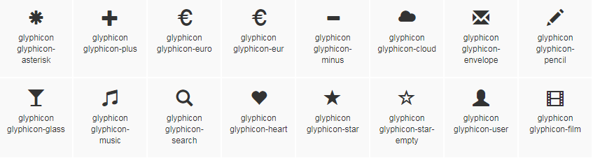

# Vue 中传递样式class参数

Icon 组件为例，在`Bootstrap`中有多个`class`用于 icon 的显示，如

```html
<span class="glyphicon glyphicon-user"></span>
<span class="glyphicon glyphicon-music"></span>
```

目的在于，调用组件时，传递一个`user`或者`music`，相应生成`class="glyphicon glyphicon-user"`或`class="glyphicon glyphicon-music"`



## 定义 Icon 组件

**第一次**

```html
<template>
    <span>
        <i :class="className"></i>
    </span>
</template>

<script>
    export default {
        name: "icon",
        props: {
            className: {
                type: String,
                required: true
            }
        }
    }
</script>
```

想当然为`class`绑定`className`，由调用者传递确切值。发现并没有什么用....

**第二次**

```html
<template>
    <span>
        <i v-bind:class="classObject"></i>
    </span>
</template>

<script>
    export default {
        name: "icon",
        props: {
            icon: {
                type: String,
                required: true
            }
        },
        computed: {
            classObject() {
                return {
                    glyphicon: true,
                    'glyphicon-' + this.icon : true // 肯定直接报错了了，语法都过不了，但思路是对的
                }
            }
        }
    }
</script>
```

看了官方的例子，知道，原来`class`可以传递一个`Object`，该`Object`其键就是`class`的值，通过设置`true`或`false`来判断是否应用该样式。

上述的`classObject()`需要返回一个对象，该对象就是我们要应用的样式，那就创建一个对象，再返回也是一样的

```html
<template>
    <span>
        <i v-bind:class="classObject"></i>
    </span>
</template>

<script>
    export default {
        name: "icon",
        props: {
            icon: {
                type: String,
                required: true
            }
        },
        computed: {
            classObject() {
                const o = {glyphicon: true};
                o['glyphicon-' + this.icon] = true;
                return o;
            }
        }
    }
</script>
```

## 小思

通过使用`o['glyphicon-' + this.icon]`的方式，将动态的键名传入对象当中，解决了在字面量初始化时无法传入的问题。

## 参考

* [Vue Class And Style](https://vuejs.org/v2/guide/class-and-style.html)
* [Pass Variable Into Javascript Object](https://stackoverflow.com/questions/3309221/pass-variable-into-javascript-object)

