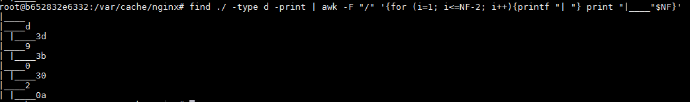

## 配置环境

* VirtualBox
* Docker version 18.03.0-ce, build 0520e24
* ubuntu:16.04 镜像
* nginx version: nginx/1.10.3 (Ubuntu)
* PHP 7.0.28-0ubuntu0.16.04.1 (fpm-fcgi)

## 步骤

摘取镜像

```bash
docker pull ubuntu:16.04
```

启动容器

```bash
# 将宿主机的 8082 映射到容器内的 80 端口
docker run -it -p 8082:80 ubuntu:16.04 /bin/bash
```

安装 nginx 及 php-fpm

```bash
apt-get update
apt-get intall -y vim # 官方镜像中没 vim 
apt-get install -y nginx
apt-get install -y php-fpm
```

`/etc/php/7.0/fpm/pool.d/www.conf`配置项说明

```conf
listen = /run/php/php7.0-fpm.sock ;监听 unix socket
```

`nginx`安装后自动运行，而`php-fpm`需要手动运行

```bash
/etc/init.d/php7.0-fpm start
```

查看进程如下

```bash
root@b652832e6332:/# ps -aux
USER       PID %CPU %MEM    VSZ   RSS TTY      STAT START   TIME COMMAND
root         1  0.0  0.2  18300  2108 pts/0    Ss   08:43   0:00 /bin/bash
root      6814  0.0  0.1 124960  1348 ?        Ss   08:55   0:00 nginx: master process nginx
www-data  6815  0.0  0.1 125320  1848 ?        S    08:55   0:00 nginx: worker process
root      7043  0.0  0.3 211740  3900 ?        Ss   09:02   0:00 php-fpm: master process (/etc/php/7.0/fpm/php-fpm.conf)
www-data  7044  0.0  0.2 211740  3048 ?        S    09:02   0:00 php-fpm: pool www
www-data  7045  0.0  0.2 211740  3048 ?        S    09:02   0:00 php-fpm: pool www
root      7046  0.0  0.1  34412  1536 pts/0    R+   09:02   0:00 ps -aux
```

将`nginx`作为反向代理服务器，将所有进来的请求转发到各自的服务器，如果`php-fpm`服务与`nginx`服务部署在同一台服务器，则可以通过 Unix Sockets 进行配置，速度比 TCP 要快

配置`nginx`，修改`/etc/nginx/sites-enabled/default`文件中的内容，最终内容如下

```nginx
upstream php {
        server unix:/run/php/php7.0-fpm.sock;
}

server {
        listen 80 default_server;
        listen [::]:80 default_server;
        root /var/www/html;

        index index.php index.html index.htm index.nginx-debian.html;

        server_name _;

        location / {
                try_files $uri $uri/ =404;
        }

        location ~ \.php$ {
                include snippets/fastcgi-php.conf;
                include fastcgi_params;
                fastcgi_pass php;
        }


        location ~ /\.ht {
                deny all;
        }
}
```

路由重写功能

如`http://www.mysite.com/index.php?module=news&action=browse&year=2014`重写为`http://www.mysite.com/news/browse/2014`

在`/var/www/html`目录下新增文件`.htaccess`，内容如下

```htacess
RewriteEngine On
RewriteCond %{REQUEST_FILENAME} !-d
RewriteCond %{REQUEST_FILENAME} !-f
RewriteCond %{REQUEST_FILENAME} !-l
RewriteRule ^(.+)$ index.php
```

修改`nginx`配置文件，配置当指定路由未找到时，重写到`index.php`，内容如下

```nginx
upstream php {
        server unix:/run/php/php7.0-fpm.sock;
}

server {
        listen 80 default_server;
        listen [::]:80 default_server;
        root /var/www/html;

        index index.php index.html index.htm index.nginx-debian.html;

        server_name _;

        location / {
                try_files $uri $uri/ @missing;
        }

        location @missing {
                rewrite (.*) /index.php;
        }

        location ~ \.php$ {
                include snippets/fastcgi-php.conf;
                include fastcgi_params;
                fastcgi_pass php;
        }

        location ~ /\.ht {
                deny all;
        }
}
```

原始 URL 将保存在`$_SERVER['REQUEST_URI']`中，最终在浏览器中输入`/news/browse/2014`，将原始 URL 进行输出


FastCGI 缓存

通过进行 `ngx_http_fastcgi_module`的配置，内容如下

```nginx
# 需要加入的配置项
fastcgi_cache_path /var/cache/nginx levels=1:2 keys_zone=SPX:100m inactive=60m;
fastcgi_cache_key "$scheme$request_method$host$request_uri";

upstream php {
        server unix:/run/php/php7.0-fpm.sock;
}

server {
        listen 80 default_server;
        listen [::]:80 default_server;
        root /var/www/html;

        index index.php index.html index.htm index.nginx-debian.html;

        server_name _;

        location / {
                try_files $uri $uri/ @missing;
        }

        location @missing {
                rewrite (.*) /index.php;
        }

        location ~ \.php$ {
                include snippets/fastcgi-php.conf;
                include fastcgi_params;
                fastcgi_pass php;
                # 设置缓存
                fastcgi_cache SPX;
                fastcgi_cache_valid 200 60m;
        }


        location ~ /\.ht {
                deny all;
        }
}
```

修改 URL , 多次访问页面后，在`/var/cache/nginx`目录中就会有缓存文件



## 大流量网站配置

**TCP Sockets vs UNIX domain sockets**

使用 Unix socket 在绝大多数场景下要比 TCP 快，除了在文件复制和内容交换的情况下

**调整进程数及连接数**

原则为与当前机子的核数相同

使用下命令查看核数

```bash
cat /proc/cpuinfo | grep processor
```

调整每个进程的最大连接数，在`nginx`中配置

```bash
events 
{ 
  worker_connections 4096; 
  multi_accept on; 
}
```

**使用 upstream 进行负载均衡**

可在本机跑多个`php-fpm`进行，使用`upstream`进行多个`unix socket`配置

```nginx
upstream php { 
  server unix:/run/php/php7.0-fpm.sock1 weight=100 max_fails=5 fail_timeout=5; 
  server unix:/run/php/php7.0-fpm.sock2 weight=100 max_fails=5 fail_timeout=5; 
}
```

**不进行access写入**

```nginx
access_log off; 
log_not_found off;
```

如果确实需要访问记录，也应当设置 buffer

```nginx
access_log /var/log/nginx/access.log main buffer=16k;
```

**开启 gzip**


## 参考

* 最佳配置 [https://www.dynatrace.com/news/blog/proper-configuration-running-php-nginx/](https://www.dynatrace.com/news/blog/proper-configuration-running-php-nginx/)
* 大流量网站配置 [http://www.softwareprojects.com/resources/programming/t-optimizing-nginx-and-php-fpm-for-high-traffic-sites-2081.html](http://www.softwareprojects.com/resources/programming/t-optimizing-nginx-and-php-fpm-for-high-traffic-sites-2081.html)