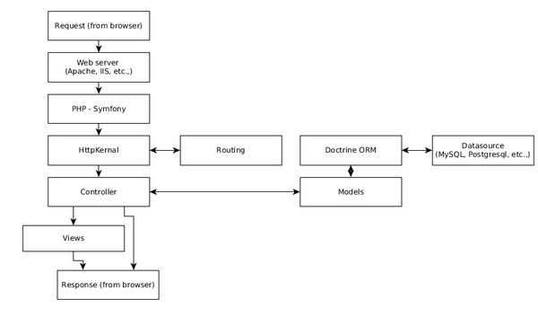

# Symfony 请求生命周期

## 步骤

1. 用户通过浏览器发送请求
2. 浏览器将请求发送给Web服务器
3. Web服务器将请求转发给后台的PHP(Symfony)
4. Symfony使用HttpKernel组件，将路由解析成对应的控制器，由控制器执行相应操作
5. 在目标控制器中执行完所有的业务逻辑
6. 如果需要与模型层做交互，则可以使用`Doctrine ORM`
7. 一旦控制器执行完，将其生成结果，也可再经由`视图引擎`，发送给Web服务器
8. 最后，Web服务器将响应返回给浏览器

## 参考

* tutorialspoint [https://www.tutorialspoint.com/symfony/symfony_architecture.htm](https://www.tutorialspoint.com/symfony/symfony_architecture.htm)