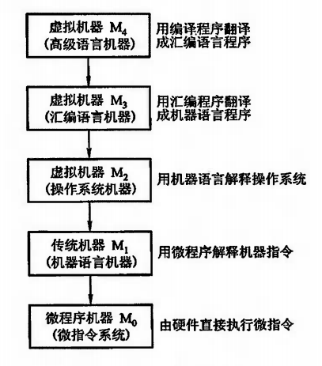
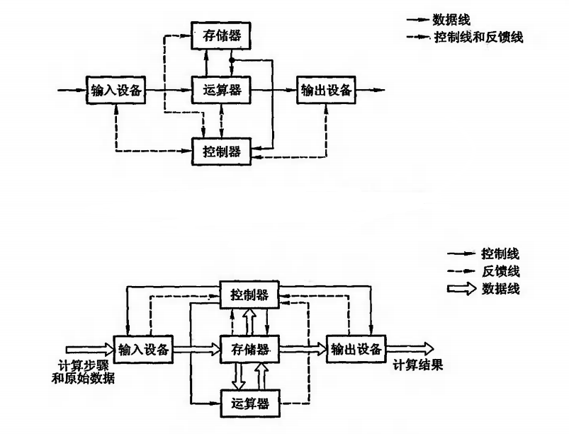
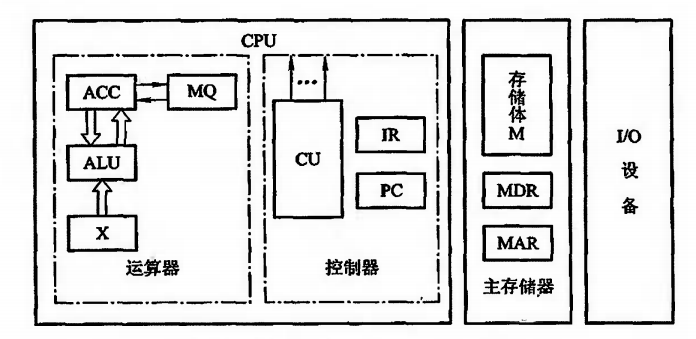

# 计算机系统概论

## 1.1 计算机系统简介

### 1.1.1 计算机的软硬件概念

* 计算机系统由`硬件`和`软件`两大部分组成
    * 硬件：计算机的实体部分，由各种电子元器件、各类光、电、机设备的实物组成
    * 软件：具有特殊功能的程序组成，通常存放在计算机的主存或辅存内

> tips: "软件"的地位和作用已经成为评价计算机系统性能好坏的重要标志，当然也依托"硬件"的支
撑，概括而言，计算机性能的好坏取决于"软"，"硬"件功能的总和

* 计算机软件
    * 系统软件：用来管理整个计算机系统、监视服务、资源调度
        * 标准程序库
        * 语言处理程序
        * 操作系统：批处理系统、分时系统、实时系统
        * 数据库管理系统
        * 服务程序：诊断程序、调试程序、连接程序
        * 网络软件
    * 应用软件：又称应用程序，根据任务所需编制的各种程序
        * 科学计算程序
        * 数据处理程序
        * 过程控制程序
        * 事务管理程序

### 1.1.2 计算机系统的层次结构

> 现在计算机解题过程：`用户编写高级语言程序(源代码)`->`翻译成机器语言程序并运行`->结果

* 直接执行机器语言的机器称为实际机器`M1`
* 汇编语言：符号式的程序设计语言
    * 必须先将汇编语言程序翻译成机器语言程序，才能被接受并运行
    * 翻译过程由机器系统软件中的汇编程序来完成
    * 虚拟机器`M2`，将汇编语言程序翻译成机器语言程序，再在`M1`上执行
    * 从本质上看，汇编语言仍是一种面向实际机器的语言
    * 每台机器必须有一种与之相对应的汇编语言
* 高级语言：虚拟机器`M3`，将高级语言程序先翻译成汇编语言程序，再在`M2,M1`(或直接在`M1`)上执行
    * 将高级语言程序翻译成机器语言程序的软件称为**翻译程序**
        * 编译程序：一次性将高级语言程序翻译成机器语言程序并执行
        * 解释程序：翻译一句，执行一句
* 微程序机器`M0`：直接将`M1`中的每一条机器指令翻译成一组微指令，构成一个微程序
* 在实际机器`M1`和虚拟机器`M2`之间还有一级虚拟机，它是由操作系统软件构成

### 1.1.3 计算机组成和计算机体系结构

* 计算机体系结构：能够被程序员所见到的计算机系统的属性，即概念性的结构与功能特性
* 计算机组成是指如何实现计算机体系结构所体现的属性

> tips: 指令系统体现了机器的属性，这是计算机结构的问题，但指令的实现，即如何取指令、分析
指令、取操作数、运算、送结构等，这些都属于计算机组成问题。

## 计算机的基本组成

### 冯.诺依曼计算机的特点

* 特点
    * 由运算器、存储器、控制器、输入设备和输出设备五大部件组成
    * 指令和数据以同等地位存放于存储器内，并可按地址寻访
    * 指令和数据均用二进制数表示
    * 指令由操作码和地址码组成
        * 操作码用来表示操作的性质
        * 地址码用来表示操作数在存储器中的位置
    * 指令在存储器内按顺序存放
    * 机器以运算器为中心，输入输出设备与存储器的数据传送通过运算器完成

### 计算机的硬件框图

* 典型的冯.诺依曼计算机以运算器为中心
* 现代计算机已转化为以存储器为中心
* 计算机的五大部件在**控制器**的统一的指挥下，有条不紊地自动工作
* CPU：中央处理器
    * 运算器
    * 控制器
* I/O设备
    * 输入设备
    * 输出设备
* 现在计算机可认为由三大部分组成
    * CPU
    * I/O设备
    * 主存储器
* CPU与主存储器合起来又称为主机，I/O设备又称为外部设备
    * 算术逻辑单元(ALU)简称算逻部件，用来完成算术逻辑运算
    * 控制单元(CU)用来解释存储器中的指令，并发出各种操作命令来执行指令
    * ALU和CU是CPU的核心部件

### 1.2.3 计算机的工作步骤

上机前的准备 `->` 上机运行

* 主存储器：包括存储体、各种逻辑部件及控制电路
    * 存储体由许多存储单元组成，每个存储单元又包含若干个存储元件，每个存储元件能寄存一们二进制代码
    * 一个存储单元可存储一串二进制代码，称这串二进制代码为**存储字**，位数称为**存储字长**
    * 主存的工作方式就是按存储单元的地址号来实现对存储字各位的存、取，称为按地址存取方式
* 两个寄存器`MAR`、`MDR`
    * `MAR`是存储器地址寄存器，用于存放欲访问的存储单元的地址，其位数对应存储单元的个数
    * `MDR`是存储器数据寄存器，用来存放从存储体某单元取出的代码或者准备存入某单元的代码，其位数与存储字长相等
* 运算器：最少包括3个寄存器和一个算术逻辑单元`ALU`
    * `ACC`：累加器
    * `MQ`：乘商寄存器
    * `X`：操作数寄存器
* 控制器：计算机的神经中枢，由它指挥各部件自动、协调地工作
    * 三个阶段
        * 取指阶段
        * 分析阶段
        * 执行阶段
    * 程序计数器`PC`、指令寄存器`IR`、控制单元`CU`
        * `PC`用来存放当前欲执行指令的地址，且具有自动加1的功能
        * `IR`用来存放当前的指令，内容来自`MDR`,将指令的操作码送至`CU`，地址码送至`MAR`
* I/O：包括各种`I/O`设备及其相应的接口，每一种设备都由`I/O接口`与主机相联

## 1.3 计算机硬件的主要技术指标

### 机器字长

* 机器字长：指`CPU`一次能处理数据的位数，通常与`CPU`的寄存器位数有关，字长越长，数的表示范围越大

### 存储容量

* 存储容量：主存容量和辅存容量
    * 主存容量：主存中存放二进制代码的总倍数，`存储容量 = 存储单元个数 X 存储字长`
        * `MAR`的位数反映存储单元的个数

### 运算速度

* 过
