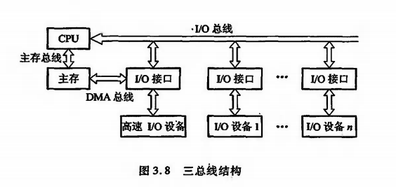

# 系统总线

## 3.1 总线的基本概念

* 连接方式
    * 分散连接：各个部件之间使用单独的连线(早期的计算机大多数用分散连接方式)
        * I/O与存储器交换信息 -> 运算器停止运算 -> 影响CPU的工作效率
    * 总线连接：将各部件连到一组公共信息传输线上
        * 总线是连接多个部件的信息传输线，是各部件共享的传输介质
        * 在某一时刻，只允许有一个部件向总线发送信息，多个部件可以同时从总线上接收相同的信息
        * 总线是由许多传输线或通路组成
        * 每条线可一位一位地传输二进制代码，一串二进制代码可在一段时间内逐一传输完成
        * 若干条传输线可以同时传输若干位二进制代码

> CPU为中心的双总线结构

* M总线(存储总线)：连接CPU和主存
* I/O总线：建立CPU与各I/O设备信息传输的通道
    * 各I/O设备通过I/O接口挂到I/O总线上
* 优点：便于增删设备
* 缺点：I/O设备与主存进行信息交换仍然需要用到CPU，影响CPU的工作效率

> 单总线结构框图

* 原则上不影响CPU工作
* 只有一组总线，需要总线判优逻辑，让部件按优先级占用总线，影响整机工作效率

> 以存储器训中心的双总线结构

* 在CPU和主存间连接一条总线，称存储总线，只提供CPU与主存的信息交换

## 3.2 总线的分类

* 按**数据传输方式**
    * 并行传输总线
    * 串行传输总线
* 按**传输数据宽度**，有8位、16位、32位、64位等
* 按**连接部件不同**
    * **片内总线**：芯片内部的总线
    * **系统总线**：CPU、主存、I/O设备各大部件的信息传输线，又称板级总线或板间总线
        * 系统总线按传输信息的不同
            * 数据总线
            * 地址总线
            * 信息总线
    * **通信总线**
        * 用于计算机系统之间或计算机系统与其他系统之间的通信
        * 按传输方式分类：
            * 串行传输：适用于远距离传输
            * 并行传输：适用于近距离传输
**数据总线**

|序号|理解|
|:---|:--|
|1|**传输各个部件的数据信息，是双向传输线**|
|2|**位数与存储字长、机器字长有关**|
|3|**数据总线的位数称为数据总线宽度**|

> 如果数据总线的位数为8位，指令长为16位，则需要两次访问主存

**地址总线**

|序号|理解|
|:---|:--|
|1|**主要用来指出数据总线中源数据或目标数据的存储单元地址或I/O设备的地址**|
|2|地址线的位数与存储单元的个数有关，单向输出|

> 若有20根地址线，则有2^20个存储单元

**控制总线**

|序号|理解|
|:---|:--|
|1|**用来发出各种控制信息的传输线**|
|2|**如何使不同的部件不同的时刻占用总线**|
|3|**对任一控制线而言，传输是单向的，但对控制总线来说，也可认为是双向的**|
|4|控制总线还起到监视各部件状态的作用|
|5|对CPU而言，控制信号既有输出，又有输入|

## 3.3 总线特性及性能指标

**总线特性**

* 机械特性：总线在机械连接方式上的一些性能
* 电气特性：总线的每一根传输线上信号的传递方向和有效电平范围
    * 地址总线和数据总线都定义高电平为`1`，低电平为`0`
* 功能特性：总线中每根控制线的功能
    * 地址总线用来指出地址码
    * 数据总线用来传输数据
    * 控制总线用来发出控制信号
* 时间特性：总线中任一根线在什么时候有效

**总线性能指标**

* 总线宽度：通常指**数据总线**的宽度
* 总线带宽：总线的数据传输速率，单元时间内总线传输的数据的位数
* 时钟同步/时钟异步：总线上的数据与时钟同步的总线称为同步总线，与时钟异步的总线称为异步总线
* 总线复用：一条信号线上**分时**传送两种信号
* 信号线数：三种总线的总和
* 总线控制方式
* 其他：负载能力、电源电压、总线宽度能否扩展

**总线标准**

* 系统与各模块之间、模块与模块之间的互连的标准界面
* 总线标准设计的接口视为通用接口
* 目前流行的总线标准：
    * ISA总线
    * EISA总线
    * VESA(VL-BUS)总线
    * PCI总线
    * AGP总线
    * RS-232C总线
    * USB总线

## 3.4 总线结构

* 总线结构通常分为**单总线结构**和**多总线结构**
* 单总线结构
    * 允许I/O设备之间、I/O设备与CPU之间或设备与主存之间直接交换信息
    * 不允许两个以上的部件在同一时刻向总线传输信息
    * 在数据传输需求量和传输速度要求不太高的情况下，尽可能采用增加总线和提高传输速率来解决
* 双总线结构
    * 将速度低的I/O设备从单总线分离出来，形成主存总线与I/O总线分开的结构
    * 通道：一个具有特殊功能的处理理，对I/O设备具有统一管理的功能

**三总线结构1**

* 三总线结构
    * 主存总线：用于CPU与主存之间的传输
    * I/O总线：用于CPU与各类I/O设备之间的传递
    * DMA总线：用于高速I/O设备与主存之间的传递
* 在任一时刻有只能使用一种总线
* 主存总线和DMA总线不能同时对主存进行存取
* I/O总线只有执行到I/O指令才能用到

**三总线结构2**

* 三总线结构
    * 局部总线
    * 系统总线
    * 扩展总线
* CPU与Cache之间有局部总线
* 扩展总线通过扩展总线接口与系统总线相连

**四总线结构**

* 相比`三总线结构2`多了一条高速总线，使用高速设备与CPU更密切
* 扩展总线与高速总线相连

## 3.5 总线控制

`判优控制`和`通信控制`

**总线判优控制**

* 总线连接设备分类，按有无对总线控制来分
    * 主设备：对总线有控制权
    * 从设备：只能响应从主设备发来的总线命令，对总线没有控制权
* 总线判优控制
    * 3根重要总线
        * BS总线请忙
        * BR总线请求
        * BG总线同意
    * 集中式：将控制逻辑其中在一处，如CPU
        * 链式查询
            * 与总线控制部件最近的设备有最高的优先级
            * 实现总线控制总线少
            * 对电路故障很敏感
            * 优先级较低的设备可能很难获得请求
        * 计数器定时查询
            * 与链式查询相比，**多了设备地址线，少了总线同意线BG**
            * 当某个请求占用总线的设备地址与计数值一致时，便获得总线使用权
            * 设备的优先级按降序排列，而且固定不变
            * 不如链式查询对电路故障敏感，但增加了控制线(设备地址线)，控制相对复杂
        * 独立请求查询
            * 总线控制部件有排队电路，可根据优先次序确定响应哪一台设备的请求
            * 响应速度快，优先次序控制灵活(可通过程序改变)
            * 控制线数量多，总线控制更复杂
    * 分布式：将控制逻辑分散在与总线相连的各个部件或设备上

> 链式查询中仅用两根线确定总线使用权属于哪个设备，计数器定时查询则需要log2^n根线，而独立请求查询则需要2n条根线

**总线通信控制**

* 在通信时间上，按分时方式来处理，即以获得总线使用权的先后顺序分时占用总线
* 总线周期：完成一次总线操作的时间
    * 申请分配阶段：需要使用总线的主设备提出申请
    * 寻址阶段：取得使用权的主设备通过总线发出本次要访问的从设备的地址及相关命令
    * 传数阶段：主设备与从设备进行数据交换
    * 结束阶段：主设备的有关信息从系统总线撤除，让出总线使用权
* 总线通信控制主要解决通信双方如何获知传输开始与传输结束，以及通信双方如何协调配合
* 总线通信的**四种方式**
    * 同步通信：通信双方由统一时标控制数据传送称为同步通信
        * 时标通常由CPU的总线控制部件发送到总线上的所有部件
        * 时标也可以由每个部件各自的时序发生器发出，但必须由总线控制部件发出的时钟信号对它们进行同步
        * 总线长度较短、各部件存取时间比较一致的场合
    * 异步通信：允许各模块速度的不一致性
        * 采用应答方式(又称握手方式)
        * 要求主、从模块之间增加两条应答线
        * 按应答方式进行分类：
            * 不互锁
            * 半互锁
            * 全互锁
